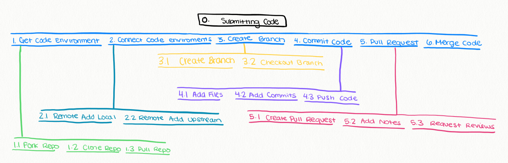

# Assignment 2: Users and Tasks

## Readings

- Personas - Copper the InMates are Running the Asylum
- Contextual Design - HCI Handbook
- Task Analysis - Dix et al. Human - Computer Interaction

## Assignment

Describe any thoughts you wish to share about the reading, and sketch out a task model related to some part of either your research or classwork.

### Personas

In summary, personas are created by designers to represent real people when going through the design process. The goal is to create products that fit the goals of individual people, instead of a general "user" audience.

 The article states, "You will have far greater success by designing for one single person". This reminded me of a Ted Talk I recently watched, [Choice, Happiness and Spaghetti Sauce](https://www.youtube.com/watch?v=iIiAAhUeR6Y). Howard Moskowitz was a researcher who conducted user studies at companies. He did a study at Prego to find the "perfect spaghetti sauce". From this study, he learned there was no perfect sauce - just perfect sauces for different people. One third of Americans preferred chunky spaghetti sauce to regular spaghetti sauce. Yet not one company had developed a sauce with chunks of tomato in it!

I think this is a perfect example on the importantance of understanding your audience. If this user study was never conducted, it could have been years until chunky sauce was created. People are very different and we must categorize them into different groups for desigining. If we take the "average" best product after doing a user study, we are finding something everyone thinks of as okay. We must dive deeper, and repeat the process in sub groups. Then, we can find the best sauce for everyones taste buds - because we know people have very different preferences when it comes to taste. This is a great example on the importance of designing for a single person.

Overall, I think personas are an excellent process to make sure we are hearing everyones voices when we are making products. Although, I think this is simply a sliver of the problem. The article continuly refered to the developers as being "guys". We can listen to personas and create user studies, but at the end of the day, if all males are the ones making the final decisions - then we are missing the point. We need to have a set of diverse engineers to ensure every voice is heard and every voice is being coded for directly.

I was shocked about the diversity comments made around creating make belief personas. The author stated "I am shooting for believability, not diversity". For example, if we are creating a persona around a nurse, the author suggested making it a female since "there are commonly more female nurses than male nurses". If we continue to develop for stereotypes, we are creating biased technolgy. The article also suggested creating the engineer to be a pimply face, nerdy male. Is it so difficult to think of a beautiful, blonde woman engineer? This needs to change. I hope designers are understanding the world is changing, and they need to change, too.

### Contextual Design

In summary, contextual design is the process of gathering data about the user, and relaying this information to development teams and key decision makers. The purpose is to make smarter decisions when setting requirements for a project. The user needs to be at the center of all decision making.

The CEO at Microsoft, Satya Nadella, loves to use the phrase "customer obsessed". It is the core priority in every organization at Microsoft - through sales and engineering teams. He uses this phrase often in his book, [Hit Refresh](https://www.amazon.com/Hit-Refresh-Rediscover-Microsofts-Everyone/dp/0062652508/ref=sr_1_1?hvadid=78477684692572&hvbmt=be&hvdev=c&hvqmt=e&keywords=hit+refresh+satya+nadella&qid=1568211798&s=gateway&sr=8-1). I agree with Satya. The customer, and the people using technology, are the top priority when designing and developing software. If engineers are creating technology for no reason - who will use it? What is the purpose? There needs to be an intent behind the tools people create. Therefore, we must study and understand the users and the problems they have.

I agree with gathering customer requirements and understanding their needs before developing. Although, I do not agree with the assumptions and process for doing this in which the article states.

There were many assumptions around developers. I will state a few:

- "...developers resist traveling"
- "They are impatient with user research"
- "They would rather build something, test it, and change it instead of getting bogged down..."

I am a traveling software engineer. I go on site directly with my customers, and understand their wants and needs face to face. It is expensive, but worth it. It is cruical to understand the customer before beginning development. I recently worked with Bacardi to make an application. I sat in a room with bartenders, managers, financial teams, mothers, developers, designers, and more. I asked questions to each audience, to try to understand the root of their problem before creating a solution. As soon as we began creating storyboards, I constantly got their feedback. It is unfair to make all these assumptions about developers. People can be many different things and we shouldn't put a hat on them to only do "programming".

The best engineers are the ones who question every decision and requirement. Engineers want to know *why* they are developing certain features, and the intent behind them. "Is this the correct technology stack? Do we really need this feature? What requirement is this fufilling?"

This is what separates a great engineer from an entry level engineer.

The article also states, "The visioning team needs to include people who understand the possibilities and constraints of the technology". This is why it is even **more** important to not corner developers to be "feature monkeys", and why we need them in the conversation. Engineers understand the technology - the limitations and possiblities. The article used an example about designers creating a website for the customer. If the designers do not know anything about websites, how are they supposed to help brainstorm the possibilites? More importantly, **is a website really the right answer to the problem we are trying to solve?** We must keep developers in the conversation so we can ensure we are solving the problems using the right technologies.

This is contradictory from the author stating, "As soon as designers start focusing on technology, technology and its problems become their central design concerns." Yes, understanding the problems of the user and their intents is the main priority. Although, technology needs to be included early in the conversation. A technical decision might make or break the problem.

A person is more than their job title. A software engineer is more than a coding monkey who writes features all day.

### Task Analysis

Task Analysis is understanding the process of how people do their job, and the individual steps they take to complete a task from start to finish.

I am a software engineer for my job. One of my largest tasks is submitting code. I submit my code using GitHub.
Here is how the GitHub work flow runs for submitting code using the task analysis structure.

