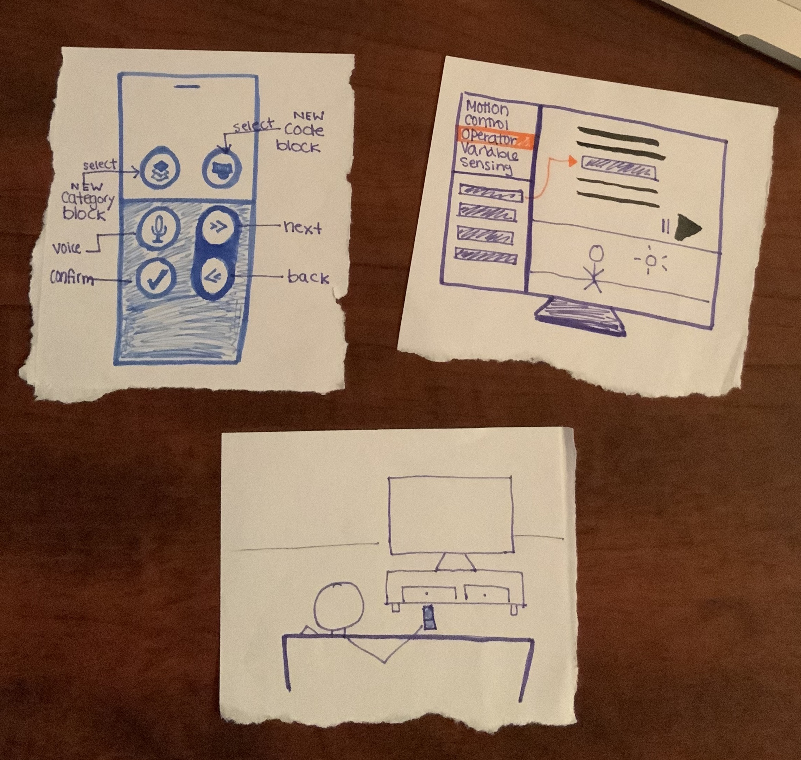

# Apple TV

**08/28/2019:** Mel not in class yet - late enrolled
Design a solution to the Apple TV remote

**09/30/2019:** Sketch a coding UI for a Apple TV

## The Remote

I think programming without a keyboard sounds miserable. That is why I wanted to use a drag and drop GUI program like Scratch for the Apple Remote. Users can build programs or games by dragging and dropping code blocks onto the screen by using the Apple remote like a Wii controller, or using the devices 6 buttons.

There are 6 buttons on the remote.

- Category Button
- Code Block Button
- Microphone
- Confirmation Button
- Forward Button
- Backwords Button

### Category Button

Used for selecting a code block category - such as motion, operators, variables, control, or sensing, which are some of the options in the GUI based programming tool Scratch. When clicking the category button, the use will see the options of categorys to choose from on the screen. They will then use the forward and backword buttons to select the category they would like to see corresponding code blocks from.

### Code Block Button

The code block button when clicked lets the user toggle between which code blocks they would like to place on the screen. The user can pick code blocks using the forward and backwords buttons, similarly to the category button. Once they find their desired code block, they can hit the confirmation button and it will pop onto the screen.

### Microphone

If at any point of time the user is have difficulties, the microphone can be used to give voice commands instead of using the Apple remote's functionality.

### Confirmation Button

This is used as a "select" button as stated before in the code and category blocks

### Forward Button

Allows the user to select the next choice in a list.

### Backwords Button

Allows the user to select the previous choice in a list.

## The Remote: Alternative Functionality

If the user does not wnat to use the buttons on the Apple Remote, they can choose to use the remote's accelerometer to drag and drop the code block on the screen instead. The motion is similar to using a Wii remote.