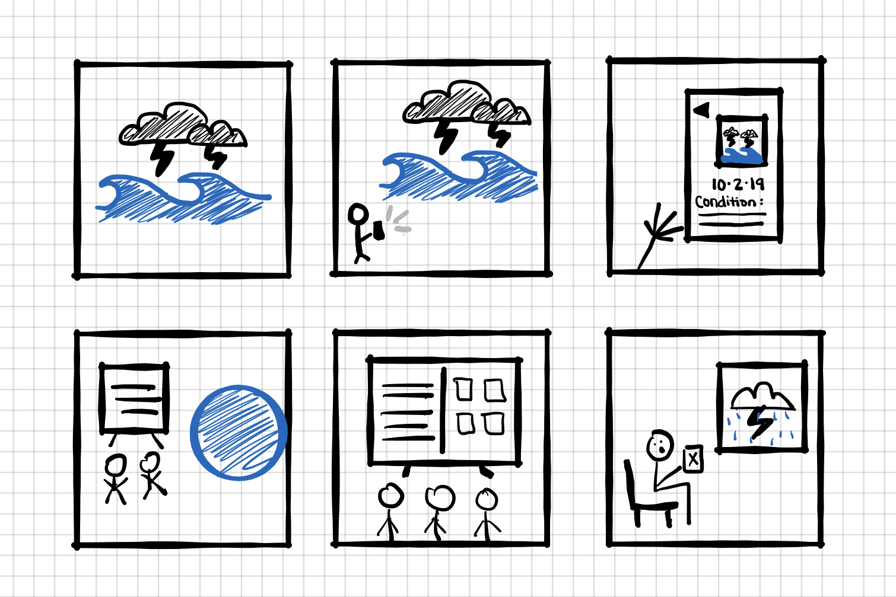

# Cultural Probe

09/23/2019: Design a cultural probe related to your project.

## Water Quality

Here is a cultural probe used to view water quality data in the Boulder Creek. I used the different camera angle approach to storyboarding to show off this cultural probe.

**View 1:**
Stormy weather affecting creek waters

**View 2:**
User documenting current water conditions of creek

**View 3:**
User sharing their findings (photo, date, and a brief description) to a mobile app for others to view

**View 4:**
Users at the Boulder creek observing a live dashboard with current water creek condition data.

**View 5:**
Users looking at the live dashboard screen close up. Live screen supports two views - current data from the Boulder Parks deparment, and current updates from users in the public.

**View 6:**
A user at home observing postings in the mobile application, deciding not to go outside due to the poor conditions in the water.
