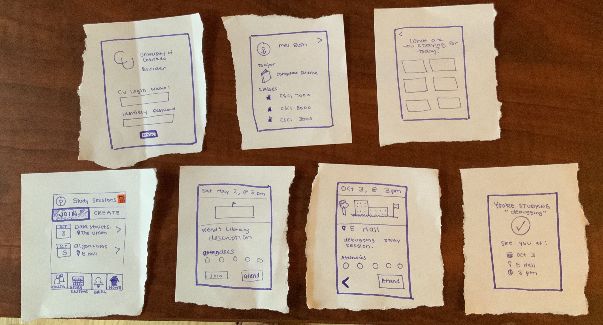
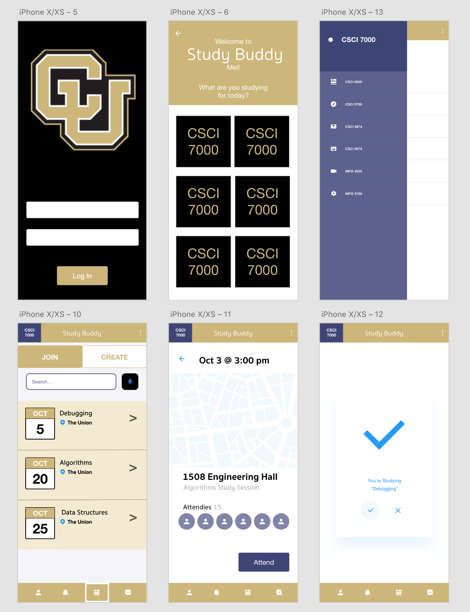

# Study Buddy App

## Instructions

- Draw a user interface on paper for a study buddy app
  
- Redraw something you previously drew
  
- Get feedback from Shaun or Supriya

- Participate in a paper prototype test

- Recreate your interface on Adobe XD

- Test your interface on a mobile device and test subject

## Task: Find a Study Group

Find and join a study group using the Study Buddy app for one of your classes.

### Paper Prototype

### Digital Protoype

