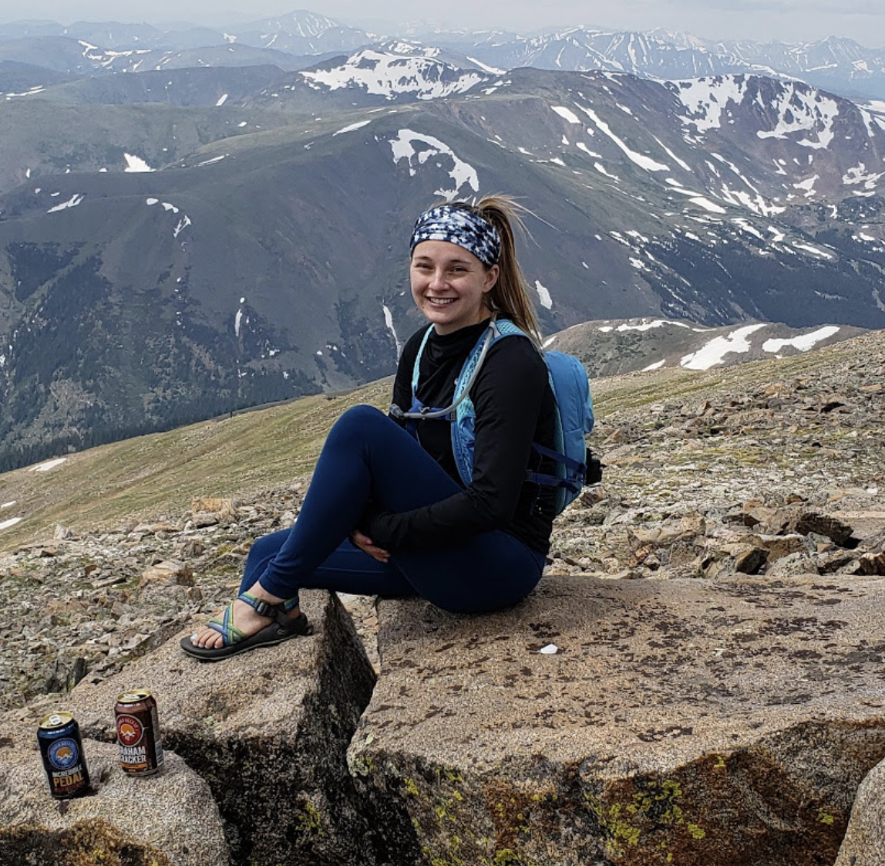

# Introduction

Welcome to Mel's CSCI 5839 User Centered Design Blog

## About

Hi! My name is Mel Rush, and I am a part time graduate student at CU Boulder. I work full time as a Software Engineer at Microsoft, and have a passion for creating beautiful looking software. I have been in the industry for two years, and am looking forward to continuing my education while also developing software at Microsoft. This is my first class at the University, and one I was most excited about taking. I believe creating accesible, user friendly systems is the core to making successful software.

## Assignments

[Assignment One: The Deep Dive](blog/assignment1.md)

[Assignment Two: Users and Tasks](blog/assignment2.md)

[Assignment Three: Formative Research](blog/assignment3.md)

[Assignment Four: Interviews](blog/assignment4.md)

[Assignment Five: Sketching](blog/assignment5.md)

[Assignment Five: Sketching](blog/assignment5.md)

[Assignment Six: Prototyping](blog/assignment6.md)

[Assignment Seven: Usability](blog/assignment7.md)

[Assignment Eight: Visual Design](blog/assignment8.md)

## Classwork

[Apple TV](classwork/appletv.md)

[Google Cardboard Personas](classwork/personas.md)

[Cultural Probes](classwork/culturalprobe.md)

[Interviews](classwork/interviewpractice.md)

[Meetup App](classwork/meetupapp.md)

## Contact

Shoot me an email at meru4213@colorado.edu
